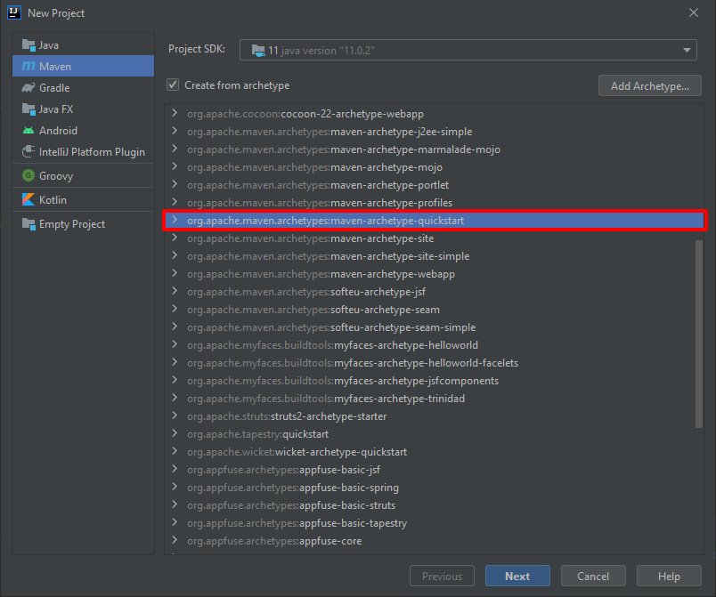
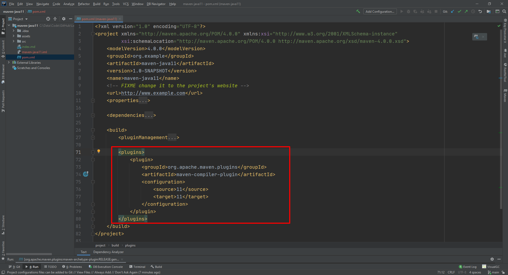
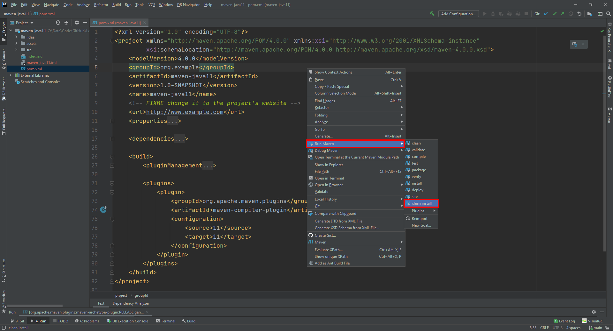
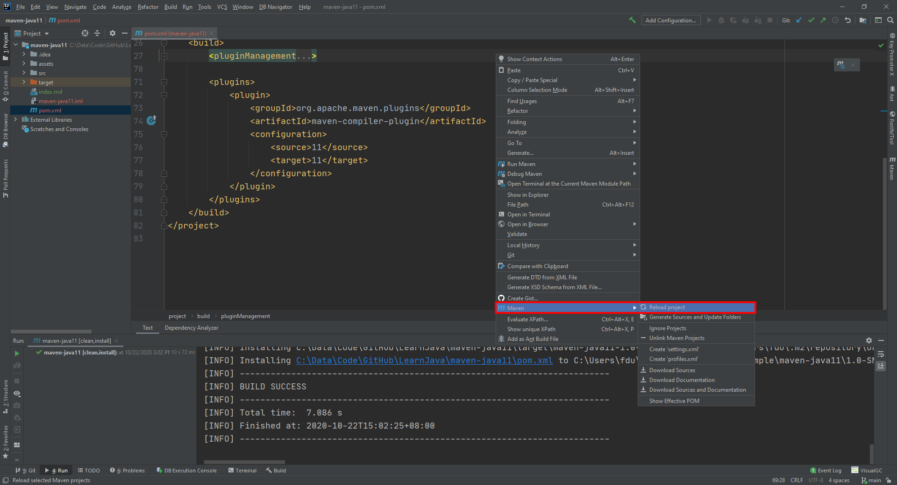

# Show how to create a java 11 project via Maven

# Reference
[Setting the Java Version in Maven](https://www.baeldung.com/maven-java-version)

# Create Maven project with quickstart archetype

# pom.xml

## 将properties中的version更改为11

    <properties>
        <project.build.sourceEncoding>UTF-8</project.build.sourceEncoding>
        <maven.compiler.source>1.7</maven.compiler.source>
        <maven.compiler.target>1.7</maven.compiler.target>
    </properties>
    
    <properties>
        <project.build.sourceEncoding>UTF-8</project.build.sourceEncoding>
        <maven.compiler.source>11</maven.compiler.source>
        <maven.compiler.target>11</maven.compiler.target>
    </properties>
    
## Add build > plugins > maven-compiler-plugin
其实这才是真正生效的地方！

        <plugins>
            <plugin>
                <groupId>org.apache.maven.plugins</groupId>
                <artifactId>maven-compiler-plugin</artifactId>
                <configuration>
                    <source>11</source>
                    <target>11</target>
                </configuration>
            </plugin>
        </plugins>

## Run Maven > clean install

## Maven > Reload project

