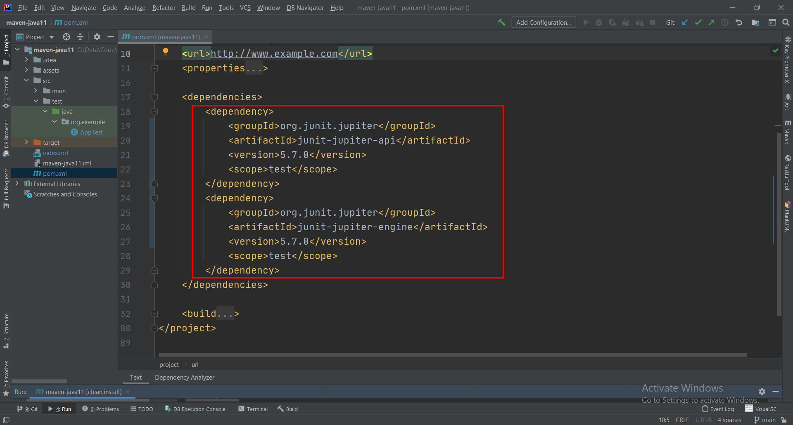

# Demonstrate how to create a java 11 project via Maven


# Reference

[Setting the Java Version in Maven](https://www.baeldung.com/maven-java-version)


# Create Maven project with quickstart archetype


# pom.xml

## Java 11

将properties中的version更改为11

```xml
<properties>
    <project.build.sourceEncoding>UTF-8</project.build.sourceEncoding>
    <maven.compiler.source>1.7</maven.compiler.source>
    <maven.compiler.target>1.7</maven.compiler.target>
</properties>

<properties>
    <project.build.sourceEncoding>UTF-8</project.build.sourceEncoding>
    <maven.compiler.source>11</maven.compiler.source>
    <maven.compiler.target>11</maven.compiler.target>
</properties>
```


Add build > plugins > maven-compiler-plugin

其实这才是真正生效的地方！

```xml
    <plugins>
        <plugin>
            <groupId>org.apache.maven.plugins</groupId>
            <artifactId>maven-compiler-plugin</artifactId>
            <configuration>
                <source>11</source>
                <target>11</target>
            </configuration>
        </plugin>
    </plugins>
```


## JUnit 5

将模板中的junit dependency替换为5：

原来的junit 4 dependency:

```xml
<dependency>
    <groupId>junit</groupId>
    <artifactId>junit</artifactId>
    <version>4.11</version>
    <scope>test</scope>
</dependency>
```

新的junit 5 dependency:：

```xml
<dependency>
    <groupId>org.junit.jupiter</groupId>
    <artifactId>junit-jupiter-api</artifactId>
    <version>5.7.0</version>
    <scope>test</scope>
</dependency>
<dependency>
    <groupId>org.junit.jupiter</groupId>
    <artifactId>junit-jupiter-engine</artifactId>
    <version>5.7.0</version>
    <scope>test</scope>
</dependency>
```





然后把 AppTest中的代码注释掉，或者删除此class，否则后面执行 Maven clean install 命令时会出错。


## Reload Maven

Run Maven > clean install


Maven > Reload project


